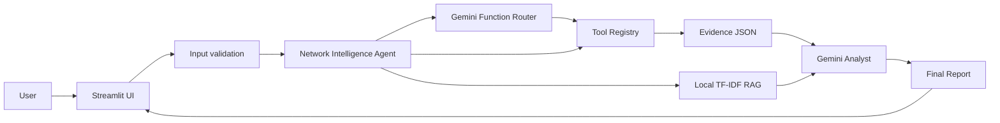
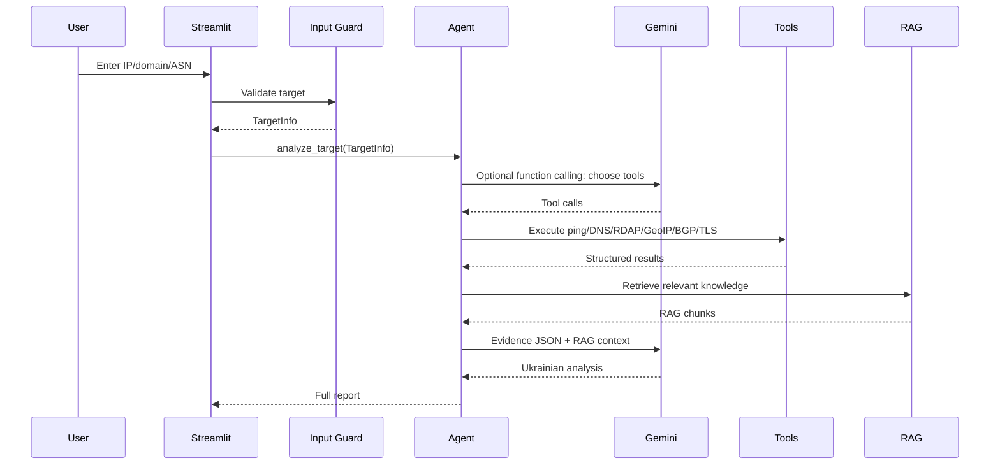
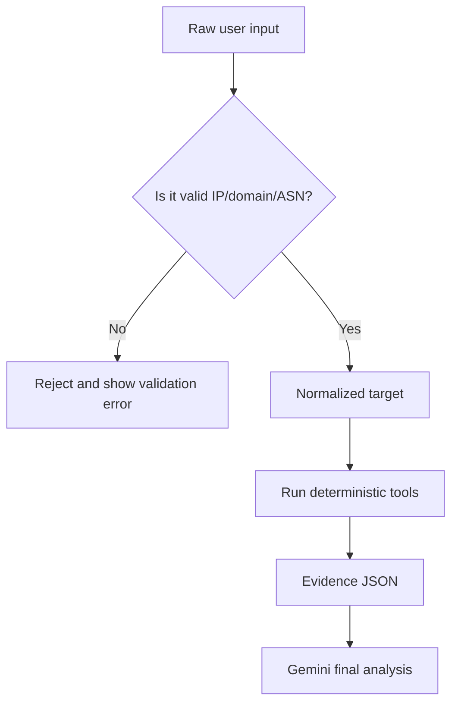

# Diagrams

## High-level data flow

```mermaid
flowchart LR
    User[User] --> UI[Streamlit UI]
    UI --> Guard[Input validation]
    Guard --> Agent[Network Intelligence Agent]
    Agent --> Router[Gemini Function Router]
    Router --> Registry[Tool Registry]
    Agent --> Registry
    Registry --> Evidence[Evidence JSON]
    Agent --> RAG[Local TF-IDF RAG]
    Evidence --> Analyst[Gemini Analyst]
    RAG --> Analyst
    Analyst --> Report[Final Report]
    Report --> UI
```

## Tool execution flow

```mermaid
sequenceDiagram
    participant U as User
    participant UI as Streamlit
    participant G as Input Guard
    participant A as Agent
    participant M as Gemini
    participant T as Tools
    participant R as RAG

    U->>UI: Enter IP/domain/ASN
    UI->>G: Validate target
    G-->>UI: TargetInfo
    UI->>A: analyze_target(TargetInfo)
    A->>M: Optional function calling: choose tools
    M-->>A: Tool calls
    A->>T: Execute ping/DNS/RDAP/GeoIP/BGP/TLS
    T-->>A: Structured results
    A->>R: Retrieve relevant knowledge
    R-->>A: RAG chunks
    A->>M: Evidence JSON + RAG context
    M-->>A: Ukrainian analysis
    A-->>UI: Full report
```

## Prompt injection defense

```mermaid
flowchart TD
    Input[Raw user input] --> Valid{Is it valid IP/domain/ASN?}
    Valid -- No --> Reject[Reject and show validation error]
    Valid -- Yes --> Target[Normalized target]
    Target --> Tools[Run deterministic tools]
    Tools --> Evidence[Evidence JSON]
    Evidence --> Gemini[Gemini final analysis]
```
